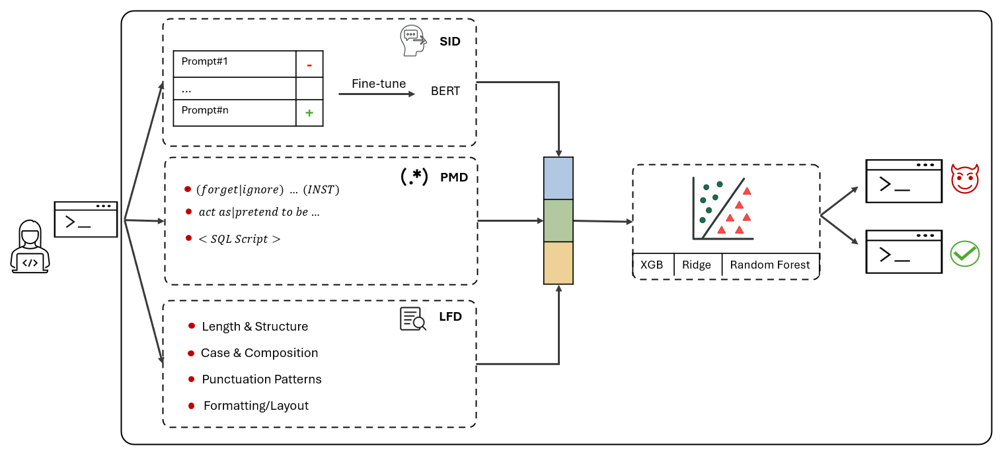

# Don’t Get Prompted: A Lightweight Modular Pipeline for Detecting and Mitigating Prompt Injection in LLMs

## Abstract
Large language models now power search, productivity, and decision-support tools, but their open-ended interaction style exposes them to prompt injection and jailbreaking attacks. These threats manipulate model behavior, bypass safety filters, and leak sensitive data, raising technical, ethical, and societal risks. As LLMs are increasingly embedded in high-stakes applications, practical defenses against such adversarial prompts are vital for ensuring reliability, trust, and safe deployment. Prompt injection enables subtle, language-driven attacks that can override model intent, leak sensitive data, or bypass safety controls. As LLMs are increasingly embedded in user-facing and autonomous systems, defending against such manipulations is critical for ensuring trust and reliability. Prior research has thoroughly examined prompt injection and jailbreak attacks, proposing both semantic and rule-based defenses. However, most existing approaches rely on a single detection strategy, are computationally intensive, or tightly coupled to specific LLM architectures limiting their practicality and generalizability. In this work, we introduce PromptGuard, a low-overhead hybrid pipeline that combines semantic analysis, pattern-based heuristics, and structural signals to detect both explicit injection attempts and subtle prompt manipulations. Unlike defenses that require model retraining or depend on LLMs for evaluation, PromptGuard operates externally and efficiently, making it suitable for deployment in real-world systems.

## Pipeline Overview

|  | 
|:----------------------------------------------------------:|
| Fig.1 -  Architectural overview of the PromptGaurd detection framework.|

## Classifier Performance Across Datasets  

All results are statistically significant with p-values ≤ 0.005.  

| **Models** | **xTRam1 Acc** | **xTRam1 Prec** | **xTRam1 Rec** | **xTRam1 F1** | **Deepset Acc** | **Deepset Prec** | **Deepset Rec** | **Deepset F1** |
|------------|----------------|-----------------|----------------|---------------|-----------------|------------------|-----------------|----------------|
| **XGB**    | 0.98 ± 0.00    | 0.96 ± 0.02     | 0.96 ± 0.01    | 0.96 ± 0.01   | 0.83 ± 0.03     | 0.82 ± 0.05      | 0.87 ± 0.11     | 0.84 ± 0.04    |
| **RF**     | 0.98 ± 0.00    | 0.96 ± 0.02     | 0.96 ± 0.01    | 0.96 ± 0.01   | 0.83 ± 0.04     | 0.87 ± 0.09      | 0.80 ± 0.10     | 0.83 ± 0.04    |
| **Ridge**  | 0.98 ± 0.01    | 0.96 ± 0.02     | 0.97 ± 0.01    | 0.96 ± 0.01   | 0.81 ± 0.14     | 0.95 ± 0.07      | 0.67 ± 0.25     | 0.76 ± 0.19    |

## Ablation Study

  

  <b>Fig. 2 -</b> Ablation study results showing the effect of incrementally removing components from the PromptGuard pipeline, evaluating each module’s contribution to final classification performance through F1 scores across two datasets.

